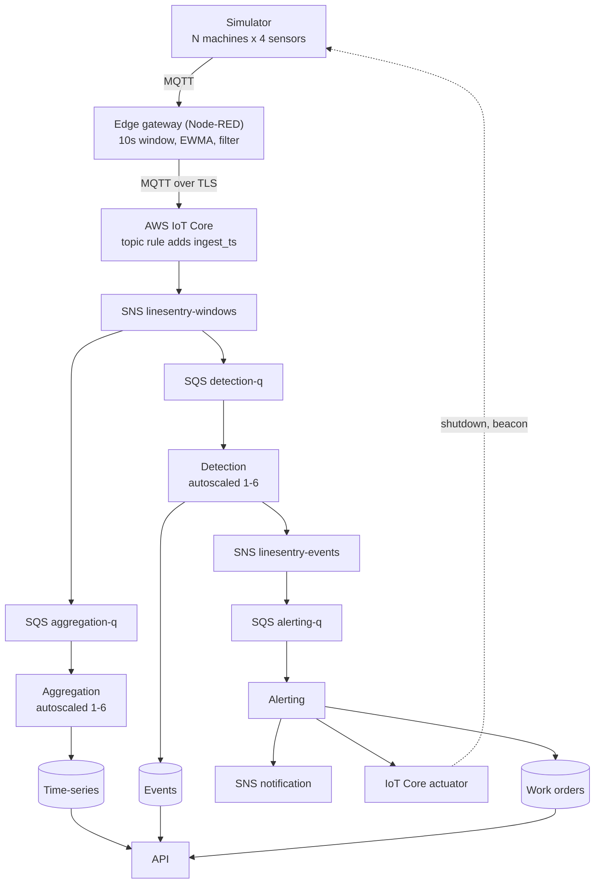

# LineSentry

A predictive maintenance pipeline for a simulated manufacturing site.

Sensors on simulated machines publish once per second over MQTT. An edge gateway aggregates them into 10 second windows and forwards only a fraction of them. The cloud side detects faults, raises events, notifies a technician and shuts the machine down. Each stage is connected by a queue, so stages scale independently.

Two arms of the pipeline are built and measured. The `deadband` arm forwards a window when the smoothed value has moved past a per-sensor band. The `dual-prediction` arm runs a least-squares predictor at the gateway, forwards only when the real value diverges from its own prediction, and carries the model on the message so the detection service rebuilds the windows the gateway suppressed.

## Pipeline



Locally the ingest bridge stands in for IoT Core and its topic rule, and alerting publishes over MQTT instead of IoT Core and SNS. Everything else is identical.

Services do not call each other. Every producer and consumer is connected by the bus, so the detection service scales on queue backlog without other services changing.

Only the detection service autoscales. Its cost grows with both machine count and fault load, and it holds a queue that grows visibly, so it is where scaling can be measured. See `infra/SCALING.md`.

## Layout

| Path | What is in it |
|---|---|
| `simulator/` | Machines, sensors, actuators and injectable faults over MQTT |
| `edge/` | Node-RED flows, and the script that generates the variant flows from `packages/core` |
| `packages/core` | Message contracts, strategy registries and runtime helpers shared by every service |
| `services/ingest` | Local stand-in for the IoT Core topic rule, bridging MQTT to the queues |
| `services/aggregation` | Writes each window to the time-series store |
| `services/detection` | Z-score, safety thresholds and remaining useful life, raises events |
| `evidence/sweep` | Offline sweep of every error bound and heartbeat, run without an AWS account |
| `services/alerting` | Technician notification, actuator command, work order |
| `services/api` | Read-only endpoints over events, time-series and work orders |
| `tools/bootstrap` | Creates the tables and seeds per-machine baselines |
| `local/` | Mosquitto and ElasticMQ configuration for the local stack |
| `infra/` | Terraform, and the AWS capability probe |
| `experiments/` | Unattended experiment runs |
| `evidence/` | Measured results, one directory per variant and run |

## Running it

Requires Node 24, pnpm 12.5.1 and Docker.
The Node version is pinned in `.node-version`, and pnpm comes from the `packageManager` field through corepack, so `corepack enable` is the only setup step.

```
pnpm install
pnpm build
pnpm test
```

The simulator and a development MQTT broker run without any AWS account or Docker:

```
pnpm --filter @linesentry/simulator broker
pnpm --filter @linesentry/simulator start 5 1
pnpm --filter @linesentry/simulator watch
```

See `simulator/SIMULATION.md` for the fault model and the topic layout.

### The whole pipeline, locally

`docker compose up` runs the entire pipeline with no AWS account: Mosquitto, ElasticMQ in place of SQS, DynamoDB Local, Node-RED running the edge flow, and the five services.

```
docker compose up -d
pnpm --filter @linesentry/simulator start 5 1
```

Then inject a fault and watch it come out the other end:

```
pnpm --filter @linesentry/simulator fault press-03 overheat
curl -s localhost:3000/events | jq
curl -s localhost:3000/workorders | jq
```

The api is read-only and listens on port 3000.

| Endpoint | What it returns |
|---|---|
| `GET /machines` | Every machine with its open event count and worst severity |
| `GET /events?limit=` | Events, newest first |
| `POST /events/:id/ack` | Acknowledges one event |
| `GET /machines/:id/timeseries?sensor=&from=&to=` | Stored windows for one sensor |
| `GET /workorders?limit=` | Open maintenance jobs |

Service images all come from the one root `Dockerfile`, which takes the service as a build argument:

```
docker build --build-arg SERVICE=detection -t linesentry-detection:dev .
```

### What runs where

Postgres is not in the local stack. The capability probe found this account can describe RDS instances but not create them, so work orders are in DynamoDB. A Postgres container locally would mean maintaining an adapter that cannot be deployed. `infra/CAPABILITIES.md` records the probe output.

## Deploying

```
make deploy     provision, build and push images, roll the services
make destroy    tear it down
make tasks      running task count per service
make plan       show what deploy would change
```

`make deploy` provisions the registries first, pushes the images, applies the rest, seeds machine metadata, then forces a new deployment so the services pick up the images.

Terraform needs `infra/terraform.tfvars` holding the `LabRole` ARN. `infra/terraform.tfvars.example` shows the shape. The file is gitignored because it carries the account number.

On AWS the pipeline differs from the local stack in two places.

The ingest bridge does not run. An IoT Core topic rule matches `linesentry/edge/#`, adds `ingest_ts` in its SQL, and delivers to the `linesentry-windows` SNS topic, which fans out to the aggregation and detection queues.

The alerting service publishes actuator commands through the IoT Core data plane and technician notifications to SNS, instead of over MQTT. Both are selected from environment variables at startup. See `services/alerting/ALERTING.md`.

The same container images run in both environments. The environment decides which adapters are constructed.

## The two arms

The edge filter and the detection algorithm are each selected by name at startup from a registry, so the two arms run in the same services, over the same queues, against the same message contract.

| | `deadband` + `baseline` | `dual-prediction` |
|---|---|---|
| Gateway forwards when | the smoothed value moved past a per-sensor band | the value diverges from a least-squares prediction by more than the error bound |
| Also forwards | on a heartbeat | on a heartbeat, and on any window at or above a safety limit |
| Message carries | the window | the window, plus the model that governed the gap it closes |
| Consumer sees | the forwarded windows | the forwarded windows and every window between them, rebuilt |
| Consumer state | a per-task history buffer | none |

Reconstruction is stateless because detection autoscales to six tasks on one queue and SQS gives no consumer affinity. Shipping the model on the message means any task can rebuild any gap, and a task that started a second ago is as capable as one that has been running for an hour.

Measured at 200 machines over 1800 seconds with 16 injected faults, against the `deadband` arm at a 60 second heartbeat:

| Arm | msg/s | Consumer coverage | Faults found | Events on healthy machines | Machines per task |
|---|---|---|---|---|---|
| `deadband`, 60s heartbeat | 15.26 | 19% | 16/16 | 50 | 2096 |
| `dual-prediction`, 0.5 sigma, 600s heartbeat | 8.78 | 100% | 16/16 | 43 | 3645 |
| `dual-prediction`, 2 sigma, 600s heartbeat | 3.38 | 100% | 16/16 | 193 | 9455 |

The heartbeat does different jobs in the two arms, which is why it moves. Under `deadband` it is the only bound on how stale the consumer's view can get. Under `dual-prediction` the consumer rebuilds the whole gap within the error bound, so the heartbeat carries liveness alone.

Running an arm locally:

```
EDGE_FLOW=linesentry-edge-flow-dp.json \
ERROR_BOUND_SIGMA=1 HEARTBEAT_MS=60000 \
DETECTION_STRATEGY=dual-prediction VARIANT=dual-prediction-b1-hb60 \
docker compose up -d
```

On AWS, `make deploy VARIANT=... DETECTION_STRATEGY=...` and `make gateway BOUND=... HEARTBEAT_S=...`.

`edge/EDGE.md` covers the gateway chain and the flow generation. `packages/core/STRATEGIES.md` states the requirements on an implementation. `packages/core/DETECTION.md` covers how the rules are tuned and why one fault produces about four events rather than one per window. `experiments/README.md` covers the offline sweep.

## Toolchain notes

pnpm only, no `npm install` or `npx` anywhere.
Use `pnpm dlx` in place of `npx`.

The pnpm version is pinned in the root `packageManager` field. Local development and the Docker images both activate it through corepack, so there is one pnpm version declared in one place.

Node is pinned to 24, the Active LTS line, in `.node-version`. Moving to Node 26 is a one line change in that file and in the `NODE_IMAGE` build argument.

Dependency versions come from the `catalog` in `pnpm-workspace.yaml` rather than being repeated per package.
