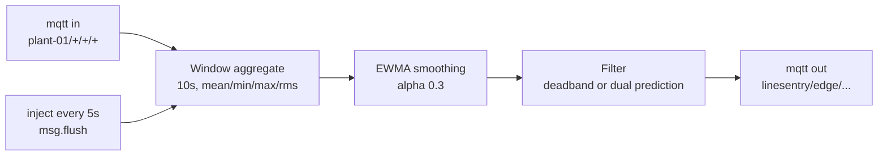

# Edge gateway

The gateway turns 1 Hz sensor readings into 10 second windows and decides which of them leave the site.
It runs Node-RED against the local MQTT broker and publishes to AWS IoT Core over TLS.

## The chain



A window closes when a reading arrives that belongs to a later window.
The flush tick emits any window that has been closed for 3 seconds with nothing new arriving, so a key that stops publishing does not strand its last window.

The EWMA carries the unrounded value forward and rounds only what it writes onto the message, so rounding does not accumulate across windows.

## The two filters

Both filters are selected by name from `edgeFilterRegistry` and both hold their own state.
`packages/core/src/edge.ts` is the one definition of each.

`deadband` forwards a window when the smoothed value has moved at least the sensor's band since the last forward, or when the heartbeat is due.
It is the filter the Distinction build measured and it is unchanged.

`dual-prediction` fits a least-squares line over the last 6 smoothed values and forwards only when the real value diverges from that line by more than `ERROR_BOUND_SIGMA` standard deviations for the sensor.
The per-sensor standard deviations are `BASELINE_SD` in `packages/core/src/plant-config.ts`.

## What the two arms give the consumer

This is the difference the error bound does not show on its own.

Under `deadband`, a suppressed window is lost.
The consumer sees nothing between one forward and the next, and it has no way to tell whether the gap was quiet or whether the gateway stopped.

Under `dual-prediction`, a forward carries the model that governed the gap it closes, along with the `window_start` of the previous forward.
The consumer evaluates that line at every 10 second boundary inside the gap and rebuilds the windows the gateway suppressed.
Every rebuilt value is within the error bound of the real one, because that is the condition under which the gateway suppressed it.

So the two arms hold different guarantees at the same nominal bound.
`deadband` bounds the error against the last value it sent and says nothing about the gap.
`dual-prediction` bounds the error against what the consumer reconstructs, at every window.

## The model travels on the message

The published dual prediction scheme runs the same predictor at the node and at the sink, and requires their state to stay synchronised.
That assumes one sink.

The detection service is not one sink.
It autoscales from 1 to 6 tasks on a single SQS queue, and SQS gives no consumer affinity, so windows for one machine and sensor land on arbitrary tasks.
Per-task predictor state would diverge and the reconstruction would be wrong.
Shared state in DynamoDB would work, but it adds a read and a conditional write to every forwarded window, which is the per-message cloud cost the technique exists to remove.

Carrying the model on the message removes the problem instead of coordinating around it.
The consumer holds no state, so any task can reconstruct any gap, and a task that started one second ago is as capable as one that has been running for an hour.

A forward carries these fields in `ext`:

| Field | Meaning |
|---|---|
| `predictor_version` | `lsq-<historyWindows>`, the predictor family and its fit length |
| `model` | `{ slope, intercept }` in force over the gap this window closes |
| `last_forwarded_window_start` | the `window_start` of the previous forward for this key |
| `divergence` | how far the real value sat from the prediction |

`model` is the model that governed the gap, not the one refitted after it.
A forward at `t1` therefore carries the model fitted at `t0`, and the consumer replays exactly what the gateway predicted at every window between them.
The first forward for a key closes no gap, so it carries neither `model` nor `last_forwarded_window_start`.

The gateway fits over real values rather than its own predictions.
Classical dual prediction feeds the predicted value back into the buffer on a suppressed window, so that the node's state matches a sink that never saw the real one.
Nothing here depends on that, because the model is transmitted, so the gateway keeps fitting on ground truth and error does not compound across gaps.

## The safety override

A window at or above the sensor's entry in `SAFETY_THRESHOLDS` forwards as `safety`, whatever its divergence.
So does a window whose prediction is at or above it.

Without this the filter would suppress exactly the faults it exists to catch.
The `overheat` fault raises temperature linearly, and a linear ramp is what a least-squares line tracks best, so the windows crossing the 80 C safety limit would sit inside the error bound and wait for the heartbeat.
The measured cost of the override is small, because a breach is rare.

## The heartbeat

Both filters forward a window when the heartbeat interval has elapsed with nothing else forcing it.
`deadband` measures that in wall clock time. `dual-prediction` measures it in window time, which makes its decision a function of the window stream alone and lets the offline harness replay it exactly.

At 200 machines with a 60 second heartbeat, heartbeats are 63% of what the `deadband` arm forwards.
The filter is not what limits the message rate at that setting.

The heartbeat does different jobs in the two arms.
Under `deadband` it is the only thing bounding how stale the consumer's view can get, so shortening it is the only way to improve fidelity.
Under `dual-prediction` the consumer reconstructs the whole gap within the error bound, so the heartbeat is left carrying liveness alone and can be relaxed without losing resolution.

## Generation

`edge/linesentry-edge-flow.json` is the one hand-authored flow and holds the `deadband` arm.

`edge/build-flows.mjs` generates the other three from it:

| File | Broker | Filter |
|---|---|---|
| `linesentry-edge-flow.json` | local | deadband, hand-authored |
| `linesentry-edge-flow-aws.json` | AWS IoT Core | deadband |
| `linesentry-edge-flow-dp.json` | local | dual prediction, generated |
| `linesentry-edge-flow-dp-aws.json` | AWS IoT Core | dual prediction, generated |

The dual prediction filter node's body is the compiled output of `packages/core`, with the module syntax and the registry wiring removed and a short driver appended.
`plant-config.js`, `predictor.js` and `edge.js` are concatenated in dependency order, which works because each one imports only the modules before it.
The registry registrations are dropped, since a function node body runs once per message and registering the same name twice throws.

The script refuses to write a flow it has not verified.
It compiles the generated body, runs it and the compiled module over the same 500 window fixture, and compares the forward decision, the reason and the `ext` on every one.
A stale build or an inliner that mangled something fails here rather than running a different filter on the gateway than the tests cover.

`pnpm build` runs the generation, so the flows cannot drift from the source.

## Running an arm

The flow file and the two tuning values are environment variables:

```
EDGE_FLOW=linesentry-edge-flow-dp.json ERROR_BOUND_SIGMA=1 HEARTBEAT_MS=60000 docker compose up -d
```

Unset values fall back to the `deadband` flow and the defaults in `packages/core/src/edge.ts`.

The generated node holds its filter in Node-RED's node context, which is the default memory store.
Configuring a persistent context store for this node would not work, because the filter is a closure.

## Tests

`packages/core/src/edge.test.ts` compiles the three function nodes out of the deployed flow with `new Function`, supplies the `context`, `node` and `Date` bindings the runtime provides, and runs them against the TypeScript chain over the same 900 second reading stream.
It asserts the same number of forwards and agreement field for field on every one.
That is what lets the offline sweep replay the `deadband` arm and still describe the arm that was measured on AWS.
