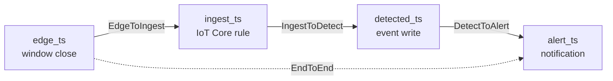

# Metrics

Every service emits CloudWatch Embedded Metric Format documents, one JSON object per line, in the namespace `LineSentry`.

On AWS those lines go to stdout. The ECS log driver forwards them to CloudWatch Logs, and CloudWatch extracts the metrics. Locally they go to the file named by `EMF_FILE`, which the experiment harness parses. The code path is the same in both cases.

## Dimensions

Every metric carries two dimensions, `service` and `variant`.

`variant` comes from the `VARIANT` environment variable and defaults to `baseline`. Two arms of the same experiment can then be compared without mixing their numbers.

Nothing else is a dimension. Dimensioning by machine id would create one CloudWatch metric per machine, which at 200 machines multiplies the custom metric cost by 200 and answers no question the experiments ask.

## Latency chain

Four timestamps are stamped as a reading moves through the pipeline. All four travel with the message.

| Stamp | Set by | When |
|---|---|---|
| `edge_ts` | Edge gateway | Window close |
| `ingest_ts` | IoT Core topic rule, or the ingest bridge locally | Arrival in the cloud |
| `detected_ts` | Detection service | Event write |
| `alert_ts` | Alerting service | Notification publish |

A stage is reported only when both its stamps are present. A stage whose interval is negative is dropped, so a clock that has moved backwards produces a missing sample rather than a negative one.

The stamps are wall clock times from different machines, so stage figures include whatever clock skew exists between them. Comparing two variants measured the same way is valid. Quoting a single number as the true latency is not.

## Two end to end figures

`WindowStoredLatency` is stamped when a window reaches the time-series store. It covers `edge_ts` through the gateway, IoT Core, SNS, SQS and the aggregation write. Every window produces one, so it is the end to end figure reported for every run, including runs with no faults.

`EndToEndLatency` is stamped when a technician notification is published. It covers `edge_ts` through to the alert. Only a window that raised an event produces one.

The two answer different questions. The first is how long the pipeline takes to carry a reading. The second is how long the system takes to act on a fault.

An earlier version measured latency only on the event path. A run with no faults produced no latency samples, which is the run the baseline target is written against.

On AWS there is no ingest service, because the IoT Core topic rule replaces it, so the aggregation service records `EdgeToIngestLatency`. Both stamps are on the window by then and the interval is the same.

## Metrics emitted

| Metric | Unit | Emitted by |
|---|---|---|
| `EdgeToIngestLatency` | Milliseconds | aggregation |
| `IngestToDetectLatency` | Milliseconds | detection |
| `DetectToAlertLatency` | Milliseconds | alerting |
| `WindowStoredLatency` | Milliseconds | aggregation |
| `EndToEndLatency` | Milliseconds | alerting |
| `MessagesProcessed` | Count | every consumer |
| `MessagesRedelivered` | Count | every consumer |
| `EventsWritten` | Count | detection |
| `ConditionalWriteRejections` | Count | detection, alerting |
| `EpisodesSuppressed` | Count | detection |
| `WindowsStored` | Count | aggregation |
| `DlqDepth` | Count | every consumer |
| `DlqArrivals` | Count | every consumer |

`ConditionalWriteRejections` is the duplicate counter. A rejection means a second attempt at work already done was refused.

`MessagesRedelivered` counts messages whose SQS receive count is above one. It is separate from the rejection count because most windows raise no event, so a redelivered window usually produces no rejection. A zero rejection count does not mean nothing was redelivered.

## Batching

A metric target in embedded metric format may be a number or an array of up to 100 numbers.

Latencies are recorded into an array and flushed on an interval, rather than one line per message. At 200 machines the pipeline handles tens of messages per second, so one line per message would produce tens of instrumentation log lines per second per task.

CloudWatch treats the array as the full set of observations, so percentiles cover every sample. Counters are summed into a single number.

Recording more than 100 samples for one metric between flushes drops the excess, because the format does not accept more.
